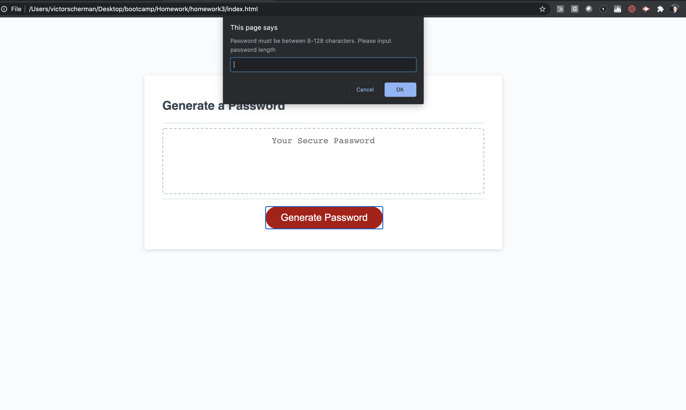
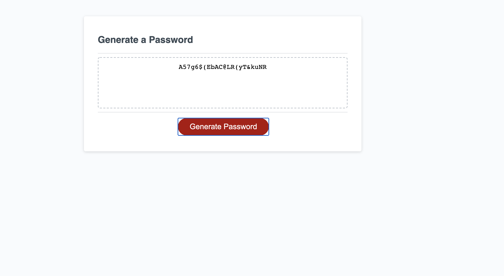

# homework3 Random Password Generator

## Our Task

Our assignment here was to create the javascript for a random password generator. The HTML and css were provided for us. Once complete, the password generator needed to do the following.

1. It needed to prompt the user for:

* A password length of 8-128 characters. Selections over or under this amount are not valid.
* Allow the user to specify if their password will include upper or lowercase letters, numbers, and symbols. 
* The user must specify at least one of the above for the password to work. They are free to select more if they wish.

2. Our working generator will then generate a password using the above parameters to do so. For instance, if they specified they wanted an 8 character password with only upper and lower case letters, that's what they should get!

## How I did it

Examining the javascript, I realized a good starting point would be to create our array of characters, numbers, and symbols. Check the .js file, lines 2-6  to see what I did. 

## Here's our arrays

```//Here are our arrays for our different character types//
  var upperCase =["A","B","C","D","E","F","G","H","I","J","K","L","M","N","O","P","Q","R","S","T","U","V","W","X","Y","Z"]
  var lowerCase = ["a","b","c","d","e","f","g","h","i","j","k","l","m","n","o","p","q","r","s","t","u","v","w","x","y","z"]
  var numbers = ["1","2","3","4","5","6","7","8","9","0"]
  var symbols = ["!","@","#","$","%","^","&","*","(",")"] 
  ```


Great. Now I needed to think about two other big parts of the code. I needed to have the appropriate prompts, and I needed to create a function that executed when the generate password button is pressed. It's a bit of a doozy to explain this all in one go, so I'll break it into chunks.


First, I wanted to start writing the code for the generatePassword() function referenced in line 81 of the .js file.


## Here's the first bit, which covers our prompts and confirms


```function generatePassword() {

  // these are the prompts the user will see, and is also the UI they'll use to select their password options//
  var numberCharacters = prompt ("Password must be between 8-128 characters. Please input password length")
  var includeUpper = confirm("Include upper case letters?")
  var includeLower = confirm("Include lower case letters?")
  var includeNumbers = confirm("Include numbers?")
  var includeSymbols = confirm("Include special characters?")
  ```


Now, for initial testing and debugging purposes, I actually didn't have any of these as prompts or confirms. I initially set them to arbitrary values. I reasoned it was one less element to worry about while I sorted out the rest of my code. An example is below. Keep in mind this didn't make it to the final code, and was just for testing purposes


 ```var numberCharacters = 12
    var includeUpper = true
    etc etc
```

I also added a command to make sure the user's entry was a whole number, as we can't have a password with 12.47 characters!!! We assign that to a variable called "characterLimit"
```
var characterLimit = parseInt(numberCharacters);
```
Great. We're about halfway there. We now have an array of options for the function to choose from, and prompts and confirm boxes to feed our function, but no actual function! Let's look at how we can fix that.

## Writing our function

Let's start by defining all of our invalid conditions. The password has to be between 8 and 128 characters. It also needs to contain at least one of the arrays above (numbers, upper and lowercase letters, symbols). 

What we do here is use the not command (!) and join multiple declarations. So if the user doesn't include upper, lower, numbers, and symbols, they're gonna get an alert. I also decided to use the same if condition for our character limit, since it leads to the same message. For this I used the OR (||) operator. Since the user can only specify a length that either too short OR too long.
  ```
  if (
    (!includeUpper && !includeLower && !includeNumbers && !includeNumbers) 
    || (characterLimit > 128 || characterLimit < 8) ){
    return alert("Password must be between 8-128 characters and contain at least one other selection")
  }
 ```


Fantastic!  Now we can get to the real meat and potatoes of our function. Let's create an empty array, where our randomly generated characters are gonna go.  We make it equal to the variable "acceptchars"

```
var acceptChars = [];

```

Great, we now have an empty array that's HUNGRY and needs to be fed. Let's do it!


Here we're specifying what happens when our confirms are selected. For instance, if (includeUpper) is selected, we  specify that our upperCase character array is going to be included in our password array. I used the .concat command, which allows you to merge multiple arrays into a single array since we will need to do that if multiple character types are selected
    
 ```   
    if (includeUpper) {
      acceptChars = acceptChars.concat(upperCase)
    }
    
    if (includeLower){
      acceptChars = acceptChars.concat(lowerCase)
    }
    
    if (includeNumbers){
      acceptChars = acceptChars.concat(numbers)
    }
    
    if (includeSymbols){
      acceptChars = acceptChars.concat(symbols)
    }
```


Great, our confirms are tied into our function now. All that's left is we need to create a loop that randomly picks out numbers from our specified array and generates a password of the desired length. Basically this little piece of code will make our break our generator. No pressure!


This was the trickiest bit for me to understand and get to work. We created a variable called pass, which we first leave as an empty string
   ``` 
    var pass= "";
   ```
Now, we create a for loop. We specify a variable, i, and initially set it to 0. As long as i is less than the character limit we specified earlier, it keeps increasing by 1. This means this function will repeat the specified number of times, until it picks out the right number of specified characters.

```
     for(var i = 0; i < characterLimit;i++){
```

we now create a variable called selectedcharacterindex, which is equal to a whole, random number multiplied by the length of our acceptedChars array. 
``` 
var selectedCharacterIndex = parseInt(Math.random()*acceptChars.length)
```
Finally, we're using the += (addition assignment) operator, which adds our accepted characters pulled from the selected character index to our password
    
```    
   pass += acceptChars[selectedCharacterIndex]
```
      

This pass variable is equal to the variable "password" mentioned in line 81 of our .js, because var password=generatePassword(). And the generatePassword() function outputs our var= pass


## Fun pretty pictures!!!!
Our first prompt

Our random password!!



## Special Thanks

I wanted to give a very big special thanks to my brother, Nick, who helped me sort through the logic of this assignment without spoon feeding me the solution. Couldn't have done it without you bro!

## License

Copyright (c) 2020] [Victor Scherman]

Permission is hereby granted, free of charge, to any person obtaining a copy
of this software and associated documentation files (the "Software"), to deal
in the Software without restriction, including without limitation the rights
to use, copy, modify, merge, publish, distribute, sublicense, and/or sell
copies of the Software, and to permit persons to whom the Software is
furnished to do so, subject to the following conditions:

The above copyright notice and this permission notice shall be included in all
copies or substantial portions of the Software.

THE SOFTWARE IS PROVIDED "AS IS", WITHOUT WARRANTY OF ANY KIND, EXPRESS OR
IMPLIED, INCLUDING BUT NOT LIMITED TO THE WARRANTIES OF MERCHANTABILITY,
FITNESS FOR A PARTICULAR PURPOSE AND NONINFRINGEMENT. IN NO EVENT SHALL THE
AUTHORS OR COPYRIGHT HOLDERS BE LIABLE FOR ANY CLAIM, DAMAGES OR OTHER
LIABILITY, WHETHER IN AN ACTION OF CONTRACT, TORT OR OTHERWISE, ARISING FROM,
OUT OF OR IN CONNECTION WITH THE SOFTWARE OR THE USE OR OTHER DEALINGS IN THE
SOFTWARE.


    
      

    


